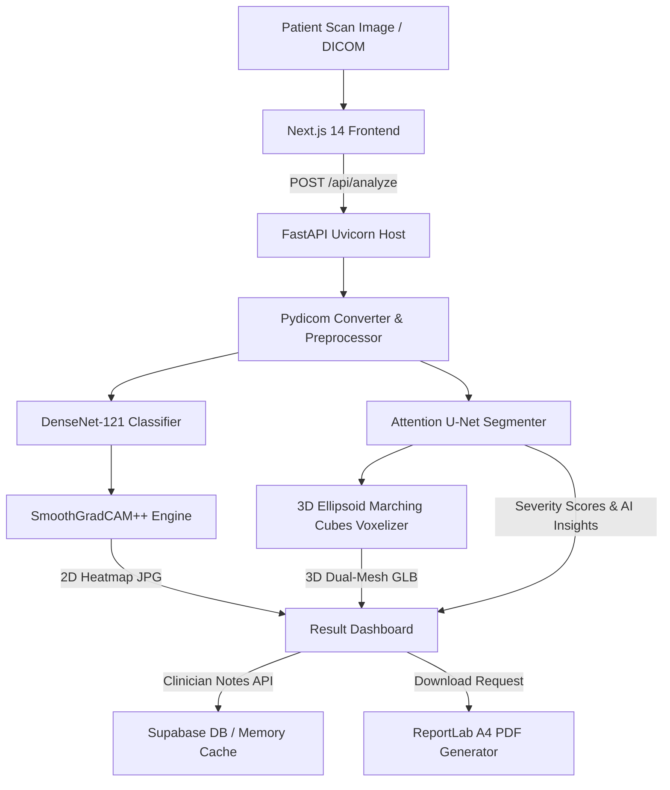

# 🫁 ExpLung-U: Deep Cognitive Chest Scan Analyzer & Volumetric Reconstructor

[](https://nextjs.org/)
[](https://fastapi.tiangolo.com/)
[](https://pytorch.org/)
[](https://threejs.org/)
[](https://supabase.com/)
[](LICENSE)

ExpLung-U is a state-of-the-art, split-stack cognitive medical CAD platform designed for digital radiology. By combining high-accuracy deep learning classifiers, neural explanation heatmaps, precise lung segmentation, and real-time WebGL-based 3D volumetric reconstructions, ExpLung-U provides a premium, interactive, and clinically explainable diagnostic cockpit for chest pathologies.

---

## ✨ Key Features & Diagnostic Modules

*   **🧠 Deep Learning Pathology Classifier**: Loads high-accuracy custom-trained DenseNet-121 classifiers (`custom_classifier.pth`) to dynamically identify 4 clinical target classes: *Normal, Viral Pneumonia, COVID, and Lung Opacity*.
*   **🔥 Neural Explanation (SmoothGradCAM++)**: Dynamically registers convolutional hooks on the final `features.denseblock4` layer, generating pixel-specific warmth maps showing radiologists exactly *why* the model made its diagnosis.
*   **✂️ Attention U-Net Lung Segmentation**: Isolates thoracic lung boundaries to compute left and right lung involvement percentages, mapping anomalies directly to graded severity scales.
*   **📦 Volumetric 3D Marching Cubes Engine**: Synthesizes 3D lungs on the fly using organic ellipsoid boundaries and tapering equations, exporting a dual-mesh `.glb` asset (*LungBase* clean view & *LungHeatmap* Grad-CAM warmth view).
*   **🎛️ Radiologist Interaction Dock**: Displays original scans and Grad-CAM overlays absolutely in the UI, allowing doctors to slide a glassmorphic opacity slider from `0.0` to `1.0` to inspect structural details.
*   **📦 On-Demand WebGL Bundle Loading**: Lazily chunk-loads heavy Three.js assets using Next.js Dynamic Imports (`ssr: false`) to keep the initial page loading speed lightning-fast.
*   **📄 Clinician Annotation Syncing & Dynamic A4 PDF Generator**: Syncs active doctor annotations in the cache and remote Supabase instance, dynamically formatting beautifully boxed patient report cards containing AI clinical care instructions and supportive medication recommendations.

---

## 🏗️ System Architecture & Data Flow



---

## 🛠️ Technology Stack

| Frontend Layer | Backend Engine | Database & Storage |
| :--- | :--- | :--- |
| **Next.js 14** (App Router) | **FastAPI** (Python 3.11) | **Supabase** (Postgres DB) |
| **React 18** & TypeScript | **PyTorch** & Torchvision | **Firebase** (Client Auth) |
| **Three.js** & OrbitControls | **TorchCAM** (SmoothGradCAMpp) | Local Memory Cache |
| **Framer Motion** (Spring UI) | **Scikit-Image** & Trimesh | ReportLab (PDF Engine) |
| **TailwindCSS** (Glassmorphism) | OpenCV & NumPy | Pydicom (DICOM Parser) |

---

## 👥 Academic Project Contribution Sheet

We are a group of 4 student developers from the **Vishwakarma Institute of Technology (VIT), Pune**.

*   **👩‍💻 Riya (Frontend Interface Designer & Responsive Layouts - Simple UX)**:
    *   *Role*: Frontend Layout & Demographics Form Developer.
    *   *Contributions*: Created Next.js landing layouts, standard grid systems, patient entry forms, and structural history panels using responsive Tailwind grid classes.
*   **👨‍💻 Swaym (Premium Interactive, 3D Volumetric Math & Parallax Scrolling Lead)**:
    *   *Role*: Premium Interactive UX, 3D Volumetric Math & Animation Engineer.
    *   *Contributions*: Developed parallax scrolling animations, connection handshake states, three-dimensional Cartesian coordinate ellipsoid formulas (`_build_volume`), mouse OrbitControls WebGL camera boundaries, and dynamic quote carousels.
*   **👨‍💻 Vedant (Core AI Pipeline, 3D Volumetric Mesh Reconstructor & WebGL Lead)**:
    *   *Role*: Deep Learning Classifier, Volumetric 3D Marching Cubes & WebGL Lead.
    *   *Contributions*: Integrated `custom_classifier.pth` parameters, configured `SmoothGradCAMpp` dynamic hook routines to fix static trend bugs, designed Python 3D mesh polygonizers (`marching_cubes`), and programmed Next.js chunk lazy-loaders.
*   **👨‍💻 Yash (Clinical Intelligence, Backend Logic & Database Engineer)**:
    *   *Role*: Clinical Insight Calculations, Backend Routes, A4 PDF Engine & Cloud DB Lead.
    *   *Contributions*: Authored clinical severity guidance matrices, programmed clinician annotations FastAPI routers, coded ReportLab PDF engines, and developed Supabase schema pruning fallbacks (`PGRST204`).

---

## 🚀 Local Installation & Setup

### Prerequisites
*   Node.js 18+ & npm
*   Python 3.10+ & Virtualenv

### 1. Backend Server Setup
Navigate to the `backend` directory, create a virtual environment, and install dependencies:
```bash
cd backend
python -m venv venv
# Activate on Windows:
.\venv\Scripts\activate
# Activate on macOS/Linux:
source venv/bin/activate

pip install -r requirements.txt
```

Create a `backend/.env` file:
```env
SUPABASE_URL=https://your-project.supabase.co
SUPABASE_SERVICE_ROLE_KEY=your-supabase-key
```

Run the FastAPI application (Port 8005):
```bash
python -m uvicorn main:app --host 0.0.0.0 --port 8005
```

---

### 2. Frontend Next.js Setup
Navigate back to the project root and install packages:
```bash
npm install
```

Create a `.env.local` file in the root directory:
```env
NEXT_PUBLIC_API_URL=http://localhost:8005
NEXT_PUBLIC_SUPABASE_URL=https://your-project.supabase.co
NEXT_PUBLIC_SUPABASE_ANON_KEY=your-supabase-anon-key
NEXT_PUBLIC_FIREBASE_API_KEY=your-firebase-key
NEXT_PUBLIC_FIREBASE_AUTH_DOMAIN=your-app.firebaseapp.com
NEXT_PUBLIC_FIREBASE_PROJECT_ID=your-project
NEXT_PUBLIC_FIREBASE_STORAGE_BUCKET=your-app.firebasestorage.app
NEXT_PUBLIC_FIREBASE_MESSAGING_SENDER_ID=your-sender-id
NEXT_PUBLIC_FIREBASE_APP_ID=your-app-id
```

Run the Next.js development server (Port 3000):
```bash
npm run dev
```

Open [http://localhost:3000](http://localhost:3000) in your browser.

---

## ⚕️ Clinical Safety Disclaimer

> [!WARNING]  
> **Diagnostic Use Notice**: ExpLung-U is an academic research prototype. It is designed to assist radiologists by offering spatial telemetry and classification guidance. It is **not** an FDA-approved diagnostic tool. Diagnostic assessments should always be verified by certified clinicians before determining patient care plans.

---

## 📄 License
This project is licensed under the MIT License - see the [LICENSE](LICENSE) file for details.
